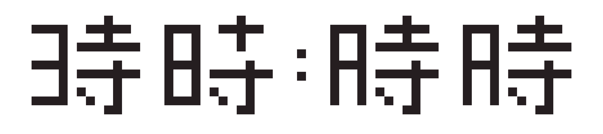
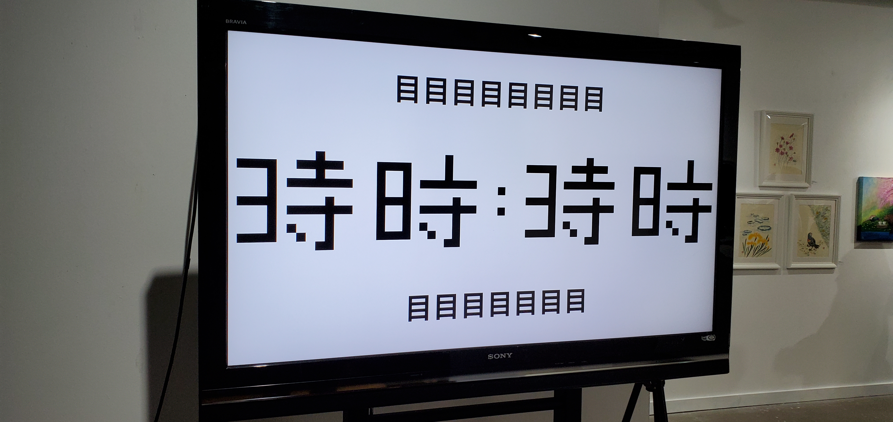
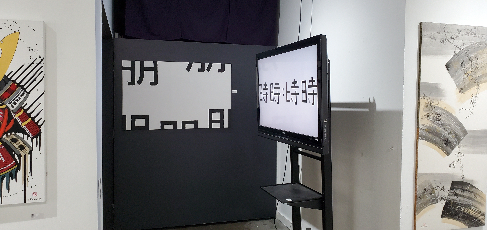

# Kanji Clock

### About
This clock artpiece displays the current time using the time kanji: 時 and is updated every minute. Each digit is represented as the removal of a stroke.

This artpiece was submitted and accepted into the Japanese Canadian Cultural Centre (JCCC) in Toronto in February 2024.

### Demo

[https://time.maciesowicz.com/](https://time.maciesowicz.com/)

### Running the Web App

In the project directory, you can run:

`npm install`

`npm run start`

Then open [http://localhost:3000](http://localhost:3000) to view it in your browser.
